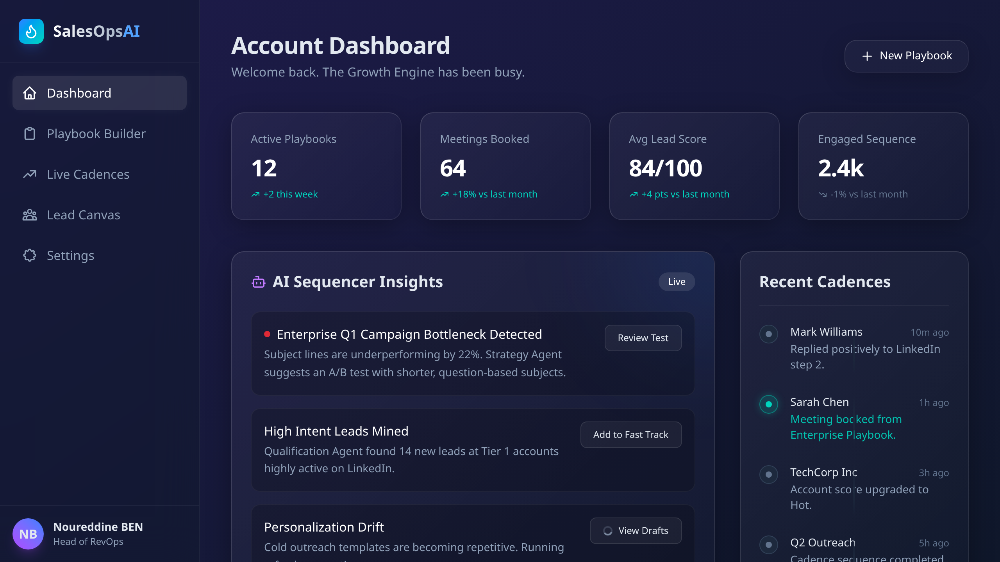
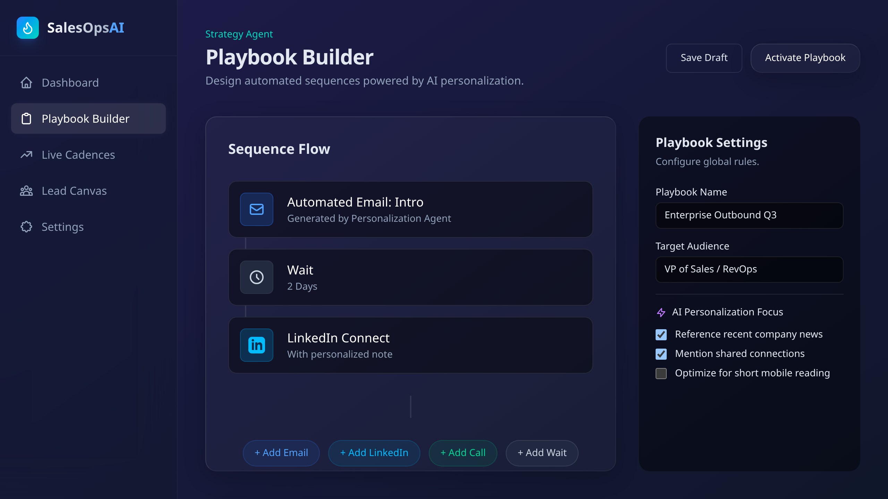
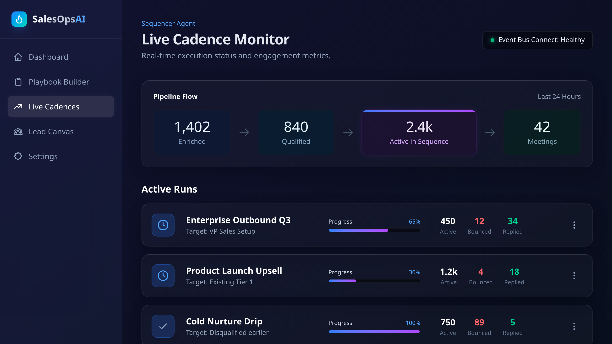
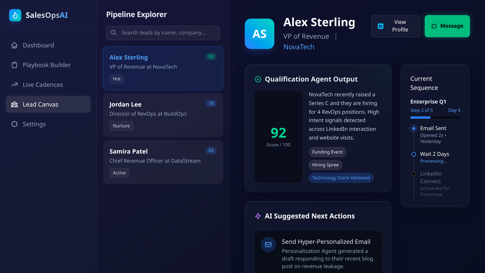
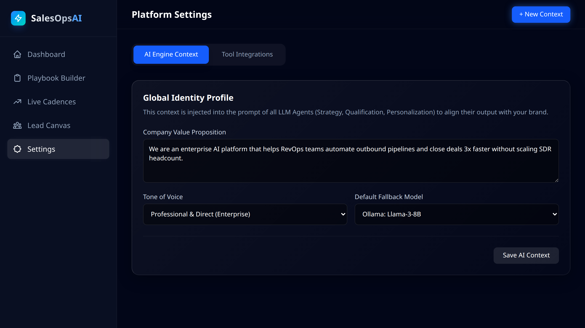

<div align="center">   
<h1 align="center">
     
     SalesOpsAI 🤖💼
  </h1>
  <p align="center"><strong>The Multi-Agent AI Platform for B2B Revenue Teams</strong></p>
  
  <br/>  
  
  
  
  
</div>

<br/>

SalesOpsAI is an enterprise-grade AI revenue operations platform. It replaces disconnected sales tools with a unified suite of **Autonomous AI Agents** capable of planning strategies, scoring inbound leads, drafting hyper-personalized outreach, and orchestrating massive cadence campaigns—all powered by a local or cloud LLM backend (like Llama 3 via Ollama).

## 🔥 Key Agent Architecture

The intelligence of SalesOpsAI is decentralized into 5 distinct specialized agents:

1. **🧠 Strategy Agent**: Analyzes your target market and automatically constructs comprehensive playbook sequences (Emails, Calls, LinkedIn steps).
2. **🎯 Qualification Agent**: Ingests fresh CRM leads, cross-references digital footprints, and assigns predictive intent scores.
3. **✍️ Personalization Agent**: Reads company news, recent funding, and shared connections to draft highly compelling, 1-to-1 cold outbound messages.
4. **⚙️ Sequencer Agent**: An orchestrator attached to a persistent Event Bus that handles delays, API limits, and executes multi-channel tasks at scale.
5. **📊 Analytics Agent**: Monitors the live cadence pipeline, identifies bottleneck steps (e.g., poor open rates), and autonomously suggests A/B test variations.

---

## 📸 Product Walkthrough

### 1. Account Dashboard
The command center. Monitor live KPI trends, supervise active cadence pipelines, and review real-time alerts from the Analytics Agent. The brand new sidebar unifies the workspace navigation.


### 2. Playbook Builder (Strategy Agent)
A visual sequence editor. Strategy Agents construct multi-touch campaigns, and you can tweak the personalization parameters before pushing them to the Sequencer.


### 3. Live Cadence Monitor
Watch the Event Bus in real-time as leads move through the sequence funnel: Enriched → Qualified → Active → Meetings Booked.


### 4. Lead Detail Canvas (Qualification & Personalization)
Deep dive into any account. View the Qualification Agent's reasoning for intent scores, and approve or rewrite the Personalization Agent's drafted emails.


### 5. Settings & LLM Context Rules
Define your core brand voice, target audience, and default LLM inference models (Ollama, Claude, GPT-4). Manage API integrations for Salesforce, HubSpot, SendGrid, and more.


---

## 🚀 Getting Started

Ensure you have [Node.js](https://nodejs.org/) installed, and [Ollama](https://ollama.ai/) running locally with the `llama3` model pulled for the AI orchestration backend to execute successfully.

```bash
# Clone the repository
git clone https://github.com/the-shadow-0/SalesOpsAI
cd SalesOpsAI

# Install Frontend dependencies
cd frontend && npm install

# Start the full stack (Frontend + Backend E2E Engine)
cd .. && npm run dev:all
```

Navigate to `http://localhost:3000` to view the application UI. The terminal will stream live outputs from the Multi-Agent engine executing workflows in the background.

## 🛠 Tech Stack

- **Frontend**: Next.js 14, React 18, Tailwind CSS, Lucide Icons, Premium Glassmorphism UI
- **Backend Orchestrator**: Node.js Event Bus (`EventEmitter` simulation), TypeScript
- **AI Engine**: Local LLM Orchestration via `ollama` Node SDK
- **Testing**: End-to-End backend pipeline tests (`test-workflow.ts`), Playwright UI UI/UX extraction.

---

⚖️ License

This project is licensed under the MIT License © 2026 Noureddine (the-shadow-0). 📜

---
